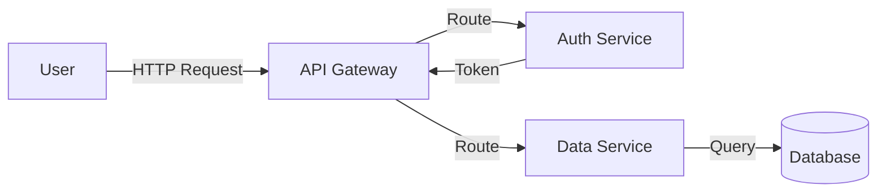
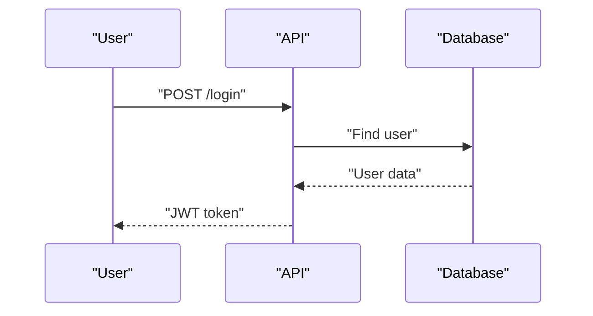
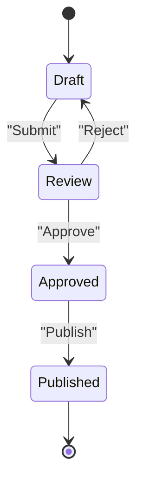
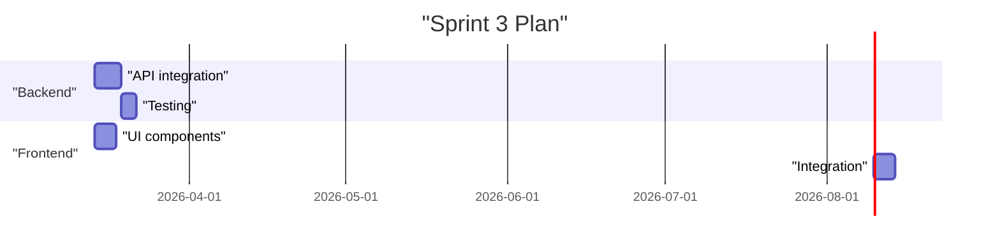

# FigJam Diagram Generator

## Purpose

Generate visual project artifacts in FigJam through a two-phase pipeline:
1. **Ideation** — analyze project context and user intent, propose suitable diagram types
2. **Generation** — build Mermaid.js code and push to FigJam via `generate_diagram` MCP

## When to use

- Describing system architecture or component interactions
- Creating context diagrams (C4-style via flowcharts)
- Building user flows or customer journeys
- Planning sprints or timelines (Gantt)
- Preparing facilitation boards for retrospectives or workshops
- Visualizing state machines or lifecycle diagrams
- Documenting API interaction sequences

## Inputs needed

- User's request (what to visualize and why)
- Project name in vAIbe-OS (for context loading)
- Optional: existing FigJam board URL for reference

## Procedure

### Phase 1 — Ideation

#### Step 1.1: Gather context

Read project materials to understand the domain:
- `Проекты/{PROJECT}/README.md` — project goals and structure
- `Проекты/{PROJECT}/Задачи/` — recent tasks for current priorities
- `Проекты/{PROJECT}/База знаний/` — accumulated knowledge
- `Проекты/{PROJECT}/Встречи/` — recent meeting summaries (if relevant)

If user provided a FigJam board URL as reference:
- Extract `fileKey` from URL (format: `figma.com/board/:fileKey/:fileName`)
- Call `get_screenshot` with `nodeId: "0:1"` and extracted `fileKey` to see the board overview

#### Step 1.2: Analyze and propose

Based on context + user request, propose 2–4 diagram options. For each:
- **Type** — one of: flowchart, sequenceDiagram, stateDiagram-v2, gantt
- **Title** — descriptive name for the diagram
- **What it shows** — 1–2 sentences
- **Why it fits** — rationale tied to the user's goal

For complex topics, propose a **set of complementary diagrams** (e.g., architecture overview + API sequence + deployment timeline).

Present as structured options → **STOP — wait for user choice.**

#### Step 1.3: Clarify details (if needed)

For the chosen diagram, clarify:
- Level of detail (high-level overview vs. detailed breakdown)
- Key entities or components to include
- Specific labels, groupings, or color coding

Skip if the user's original request was already specific enough.

### Phase 2 — Generation

#### Step 2.1: Design the Mermaid.js code

Build the diagram following MCP constraints (see reference below). Critical rules:
- Direction `LR` by default for graph/flowchart
- ALL shape and edge text in double quotes: `["Text"]`, `-->|"Edge Text"|`
- No emojis in Mermaid.js code
- No `\n` for new lines
- Keep diagrams simple unless user explicitly asks for detail
- Color styling sparingly for graph/flowchart, never for gantt
- No notes in sequence diagrams
- Never use the word `end` in classNames

#### Step 2.2: Preview and confirm

Show the user:
1. The Mermaid.js code (for transparency and future reproducibility)
2. Brief description of what the diagram will contain
3. The `name` parameter (title that will appear in FigJam)

**STOP — wait for user approval** (or corrections).

#### Step 2.3: Generate in FigJam

Call MCP tool `generate_diagram`:

```
Tool: generate_diagram (server: plugin-figma-figma)
Arguments:
  name: "<human-readable title>"
  mermaidSyntax: "<Mermaid.js code>"
  userIntent: "<description of user's goal>"
```

If the tool returns an error:
- Analyze the error message
- Fix the Mermaid.js syntax
- Show corrected code to user
- Retry generation

#### Step 2.4: Report result

After successful generation:
- Confirm the diagram is now in FigJam
- Remind that positions, fonts, and visual styling can be adjusted directly in Figma
- If a set of diagrams was planned — proceed to the next one (repeat from Step 2.1)

## Diagram Type Catalog

### Flowchart / Graph — Architecture & Processes

**Best for**: system architecture, process flows, user journeys, decision trees, C4 context diagrams, facilitation board structures



**Shape vocabulary**:
- `["rectangle"]` — services, components, steps
- `("cylinder")` — databases, storage
- `{"diamond"}` — decisions, conditions
- `(["stadium"])` — start/end points, actors
- `[["subroutine"]]` — external systems, grouped processes

**Tips**:
- Use `subgraph "Group Name"` to cluster related components
- `LR` for architecture views, `TD` for process/decision flows
- Color styling via `style NodeId fill:#hex,stroke:#hex` — use sparingly

### Sequence Diagram — Interactions

**Best for**: API flows, component communication, user-system interactions, integration protocols



**Tips**:
- `->>` for requests (solid arrow), `-->>` for responses (dashed)
- `activate` / `deactivate` to show processing time
- `alt` / `else` for conditional branches, `loop` for repeated sequences
- Do NOT use `note` (MCP limitation)

### State Diagram — Lifecycles

**Best for**: object state machines, task lifecycles, workflow states, status transitions



**Tips**:
- `[*]` for start/end states
- `state "Long Name" as shortAlias` for readability
- Nested states: `state ParentState { ... }` for complex lifecycles

### Gantt — Planning & Timelines

**Best for**: sprint planning, project timelines, release schedules, roadmaps



**Tips**:
- No color styling (MCP limitation)
- Use `section` to group by team, area, or phase
- Use `after taskId` for dependencies between tasks

## Creative Applications

Some visual artifacts don't map directly to standard diagram types. Use these patterns:

| Artifact | Approach |
|---|---|
| **C4 Context diagram** | `graph LR` with subgraphs for system boundaries, actors as stadium shapes |
| **Swimlane process map** | `graph TD` with subgraphs per lane (team/role), arrows crossing lanes |
| **Decision matrix** | `graph TD` with nodes as criteria rows, styled edges for scoring |
| **Retro board structure** | `graph LR` with subgraphs for each section (Check-in, Review, Discussion, Action Items) |
| **User journey** | `graph LR` linear flow with colored nodes for pain points / moments of delight |
| **Dependency map** | `graph LR` with nodes per component, edges showing dependencies |
| **Architecture Decision Record** | `graph TD` showing options → evaluation criteria → selected option |

For artifacts that need **interactive elements** (sticky notes, voting, live editing) — generate the structural framework as a diagram, then advise the user to add interactive elements directly in FigJam.

## MCP `generate_diagram` Reference

| Parameter | Required | Description |
|---|---|---|
| `name` | Yes | Human-readable title for the diagram |
| `mermaidSyntax` | Yes | Mermaid.js code |
| `userIntent` | No | Description of user's goal (helps with error recovery) |

**Supported types**: `graph`, `flowchart`, `sequenceDiagram`, `stateDiagram`, `stateDiagram-v2`, `gantt`

**NOT supported**: class diagrams, timelines, venn diagrams, ER diagrams, font changes, moving individual shapes

**After generation**: the diagram appears in FigJam. Repositioning shapes and font customization are only available through the Figma UI.

## Output format

- Diagram(s) created in FigJam via `generate_diagram` MCP
- No additional files saved in vAIbe-OS

## Quality bar

- [ ] Project context was analyzed before proposing diagram types
- [ ] User selected the diagram type from presented options
- [ ] Mermaid.js code follows all MCP constraints (quotes, LR default, no emojis, no `\n`)
- [ ] User reviewed the Mermaid.js code before generation
- [ ] Diagram was successfully created in FigJam (no MCP errors)
- [ ] Diagram is readable: clear labels, not overcrowded (≤ 20 nodes unless requested)
- [ ] Diagram title is descriptive and meaningful

## Anti-patterns

- Generating diagram without understanding the project context
- Creating overly complex diagrams (> 20 nodes without user request for detail)
- Using Mermaid.js features not supported by the MCP (class diagrams, notes in sequence, ER, etc.)
- Skipping the preview step — always show code before calling `generate_diagram`
- Using emojis or `\n` in Mermaid.js code (breaks MCP)
- Forgetting to put text in double quotes for graph/flowchart shapes and edges
- Not offering alternative diagram types when the chosen one doesn't fit well
- Generating a single monolithic diagram when a set of focused diagrams would communicate better

## Related knowledge

- `.vaibe/skills/software-architecture-patterns/SKILL.md` — architecture diagrams (DDD context maps, microservices topology, event-driven flows)
- `.vaibe/skills/strategy-frameworks/SKILL.md` — Wardley Maps, Business Model Canvas, Value Proposition Canvas for strategic diagrams
- `.vaibe/skills/devops-practices/SKILL.md` — CI/CD pipeline diagrams, infrastructure topology
- `.vaibe/skills/agile-frameworks/SKILL.md` — Scrum/Kanban board layouts, sprint flow visualizations
